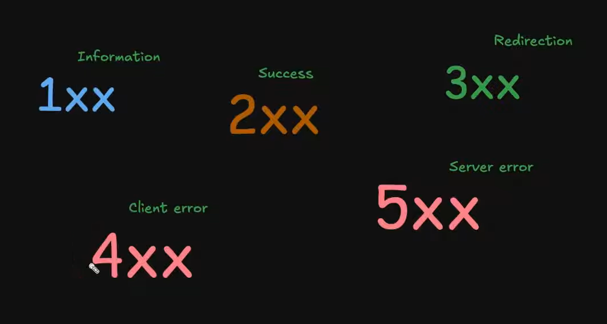

# Response Codes:
- used to communicate teh Result of the Response in **Standardized way**.
- These Codes are Standardized irrespective of the language.
- These are always 3 digit numbers.
- It helps to inform Client whether the result i successful, Server error, bad request-400, unauthorized access-401
- Depending on the Starting digits, we CATEGORIZE them into different types of errors:

## 1xx codes (Information):
- These are sent by servers to client to inform It has Received the headers and the client can proceed in sending the Request body.
- USed for switching Protocols as requested by client, example UPGRADING from HTTP to WebSocket(101).
- used in large uploads
- Used when client side makes one single connection, and through that connection many request will be sent in one single go to the server.

## 2xx codes(Success):
- 200 => Successful response
- 201 => Requesr has been fiulfilled and resulted in Creation of New Resource!
- 204 => Comes when server accepts the Pre-Flight Request, this just tells the Client side that The request was Successful but no content to be Returned.

## 3xx (Redirection):
- 301 => The requested Resource has been PERMANENTLY moved to a new URL. This works when we change backend route/url name to another, when client hit the url, we gracefully redirect it to the new URL while sending the 301 code.
- 302 => TEMPORARY Redirection to the requested Resource. This implies temporarily the resource request is redirected, BUT THE CLIENT SHOULD STILL USE THE SAME URL!
- 304 => NOT MODIEFIED: The requested Resource hasnt been modifie since the last time the client Requested it. THIS IS MOSTLY USED WITH CONJUNCTION with CONDITIONAL GET REQUEST to make Efficient Caching. THis is to let the client Know that the resources hasnt been changed and it can render the cache which is alrdy stored in the browser.

## 4xx (Client Errors):
- 400: BAD REQUEST - It happend when client sends illogical or unappropriate data.Example: When the server expects email the client sending phone number or age.
- 401: UNAUTHOIZED REQUEST- Happens wither when JWT Token si not attached with the request or when The Session/Token has Expired.
- 403: FORBIDDEN - The Server has Understood the Request but refuses to AUTHORIZE.(role based)Happens when the user doesnt have **permission** to access the Resource.
- 404: UNAIVALABLE RESOURCE - **happens when either the URL is incorrect or the Resource has been Deleted**!
- 405: INVALID METHOD/METHOD NOT ALLOWED- in place of client using GET method, teh client used POST method to req resource.
- 409: CONFLICT - This occcurs when we are trying to Create a new resource which already exist but the server doesnt want redundant copies, so there is a CONFLICT(RESOURCE ALREASY EXIST!)
- 429: TOO MANY REQUEST- Rate Limitting

## 5xx (Server Error):
- 500: INTERNAL SERVER ERROR 
- 501: NOT IMPLEMENTED - The server CURRENTLY doesnt support the HTTP method ,but planning to add it soon!
- 502: BAD GATE-WAY
- 503: SERVICE UNAIVAIBLE - Used at times of High Traffic OR when the Route is under MAINTENANCE, so service is Unaivalable RN.
- 504: GATEWAY TIME OUT<

## <a href="../3) Types of Request/readme.md">Previous: Types of Request</a>
## <a href="../5) HTTP Caching/readme.md">Next: HTTP Caching</a>