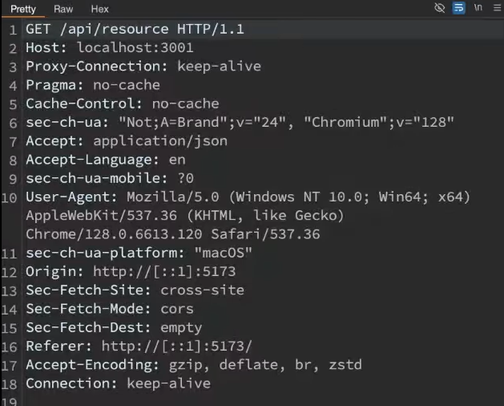

# Content negotiation:
- Mechanism by which the Client and Server Agree on the BEST Format to Exchange Data.
- Three tyoes of Content negotiation:
- - 1) MEDIA TYPE: Client Specifies the format , through ```ACCEPT``` Header. ex: JSON/XML
- - 2) LANGUAGE NEGOTITATION:The Client Request Content in Specified Language, using ```Accept-Language``` HEADER. it could be English, Spanish
- - 3) Encoding NEgotiation: The client specifies which encooding it supports with ```Accept-Encoding``` HEADER. Server responds with that compresseed format


Exmple:<br>


## <a href="../5) HTTP Caching/readme.md">Previous: HTTP Caching </a>
## <a href="../7) HTTP Compression/readme.md">NExt: HTTP Compression </a>