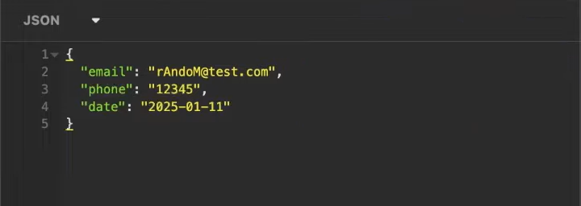
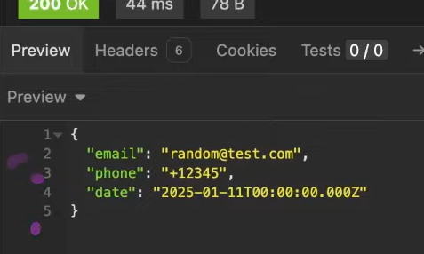

# Transformation 
- Transformation is the process which happens on the data which goes through VALIDATION PIPELINE, if the data is validated, some functions are acted upon the data so that it will be easier for the server to process the data.
## Validation and Transformation Pipeline:
-  We generally do the Validation and Transformation in one single Pipeline, which is actually Input Layer, so if there is any bug or error no need to look up on other parts, we can just check this place.
- **NOTE: The values that we get from PARAMS is always a STRING value**
- In order to work with params value, we need to TypeCast it to the desired Type and Work on it.

### NOTE:
- For all API calls, we need Frontend as well as Server Side validation of the passed data.
### Purpose of Front end Validation:
- Its only to improve the UX and response speed.
- The user doesnt want to wait for seconds for only to result error.
- It's NOT for Security or Integrity.

### Purpose fo Server Side validation:
- **Security and Integrity of the Data and System.**
- SHOULD NOT depend upon Server side Validation, as a request can come from any client, example: POSTMAN, it doesnt have a front end to validate the data.
- Therefore the Validation logic should be perfect.

#### Transforamtion Example:
- While Sending: 

- The response from Server after Transformation: 
    