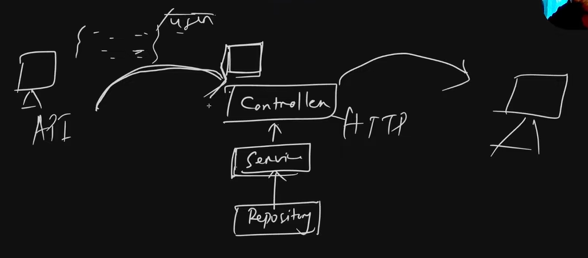

## Different Layers of execution:

## The flow:
- 1) The API request Hits the backend, route matching happens 
- 2) After Route Matching, the Data is Validated
- 3) After Data is Validated, it goes into the Controller layer, where it calls the Appropriate services/business logic in Service Layer
- 4) In service layer the business logic is applied over the Received Data and it makes the Repository layer to make DB calls if needed.

### 1) Repository Layer:
- This Deals with DB Connection, Db Query Execution, insertions, Deletions , anything Related to Data.IT could be any DB, Redis or Traditional DB
- Executes queries: inserts, updates, deletes, selects; nothing about HTTP or business rules.
- Is called by the service layer to fetch or store data; usually 1+ repository calls per service method.
- Should not contain validation logic about request payloads or HTTP; only DB-level constraints like types and not‑null exist here
### 2) Service Layer:
- This layers has the things which an API Calls does.
- **Implements business logic**: deciding what an API “does” (create book, send email, trigger webhook, etc.)
- Assumes it receives already validated and properly shaped data from the controller’s validation pipeline.
- Should not deal with HTTP specifics like status codes or request parsing; that stays in the controller

### 3) Controller Layer:
- It calls the methods in Service Layer.
- Stays thin: no real business logic, just orchestration of request → service → response
- **Responsible for all HTTP-related concerns**: which status code to send, response structure, and mapping server results to responses. We want the Business logic part and the handling HTTP request part different so we have kept as two different layers.
- **Handles “data in” and “data out” of the API**: request body, query params, path params, headers, and the response payload.
- Calls the appropriate service method and passes the validated/parsed data to it.
- Whatever Data is Returned to the Controller Layer by the Service is returned to the User.
- Translates service results (or errors) into HTTP responses: status codes, response body, error messages

### 4)Validation and Transformation layer:
- **Validation is Done at Entry POINT!**
- Backend (server-side) validation is for security and data integrity, and must exist regardless of frontend.
- Runs after route matching but before controller logic and service/business calls.
- This is just above the Controller layer.
- It validates the Data type which comes into the Backend API
- Before we make any transformations on the Data received mostly as JSON, we want to make sure that the Structure is valid so that the APIs can process it.
- It checks whether the KEY and its corressponding Data type is there correctly!
- We can do this with ZOD.