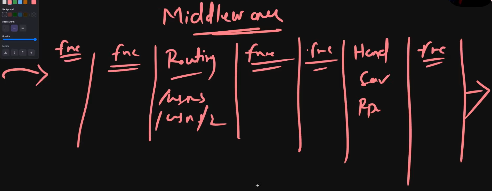

# Middlewares:
- In this we will see how the Request Life Cycle is implemented with Middlewares

- There will be Few Middlewares before getting redirected to the Route, and after redirecting to the INtended Route, there will be series of Middleware untill response is sent back to client.
- Middlewares are executed between Routing and Handlers.
- MIddlewares are OPTIONAL functions, which can be implemented depending on the requirement.
- Middlewares are also handlers , but along with Request and Response object they also get ```Next``` function which passes the **execution** from one Middleware to the next CONTEXT which processes the execution.
- Middleware are capable of sending RESPONSE to the client instead of just passing the execution to next processing context.
- Order of passing execution between Middlewares is IMportant


## Why do we use Middlewares ? Why not use Handlers?
### 1) To Reduce Code Duplication 
- It is Similar usecase of using Functions in Programing, We use functions to avoid writing same lines of code multiple times.
- We use Middlewares so that we can reuse the function in between of Different Handlers as many times we want.
- We also use this so that the server wont execute everything.