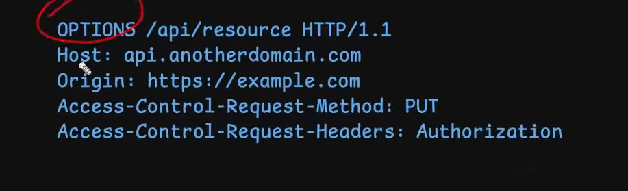

# Types of Request:
## 1) Simple Request

## 2) Preflighted Request:
- most of the requests are considered as Preflighted Request
- It consists of Options Method.
- example:  

#### Conditions for a requested to be Preflighted Request :
- 1) The Request must be Cross Origin
- 2) One of the three:
- - 1) It must be Either PUT or DELETE Request, should not be GET, POST or HEAD
- - 2) The request content type should be other than: application/ , multipart/form-data or text/plain
- - 3) the Request should have Non simple headers like: Authorization, Custom Header.

    