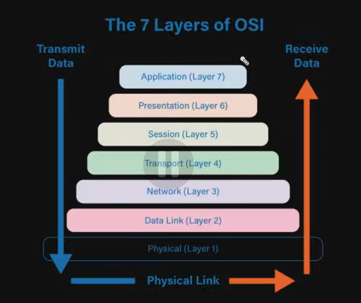

# HTTP
- A medium through which Server and Client Communicate with each other

## Properties:
### 1) Stateless:
- It has no memory of Past Interactions
- Each request must include all Necessary Data.
- Developers should implement State Management Techniques in order to store Sessions, Token or Cookies
#### Advantages:
- Simplifies Server Design
- It makes teh application Scalable, because no server needs to keep track of the Information that is transferred over HTTP request.

### 2) Client Server Model:
- Communcation is always Initiated by Client
- Server just responds to it
- TO send and Receive Requests first the Client and Server needs to form a connection, for that HTTP uses TCP (which is one of Transfer Protocol), this TCP uses 3 way handshake.

# OSI Model:

- In OSI model, as Backend Engineer, we mostly Deal with Application layer.

# Evolution of HTTP:
- in HTTP/1.0 , each request created a new Connection and closed, which is inefficient inn term of performance
- in HTTP/1.1, introduced persistent TCP connection, multiple requests adn responses can be made in single TCP connnection, this increased Performance. 
- HTTP/2.0 : Introduced Multiplexing, allowing multiple reqs or response in single connection
- HTTP/3.0 :  It is Designed over UDP, this improved Performance with Faster connection comletion. reduced latency.

# Message:
- Request Message and Response Message

## <a href="./1) HTTP Headers/readme.md"> HTTP Headers </a>

